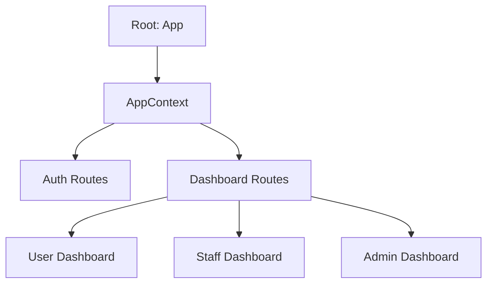
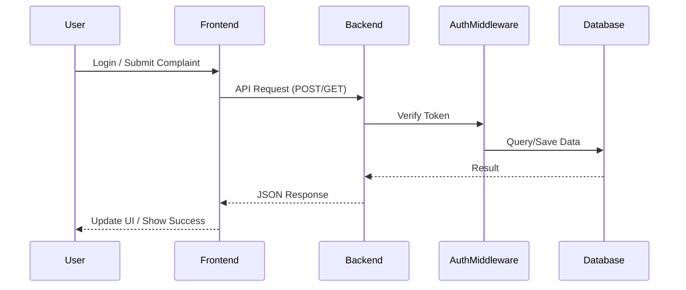
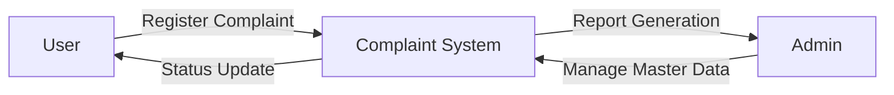

# Project Record: Complaint Raising Management System

**Student Name:** [Your Name]
**Register Number:** [Your Register Number]
**Course:** [Your Course Name]

---

## Abstract (iv)
The **Complaint Raising Management System** is a digital platform designed to streamline the process of reporting and resolving infrastructure, hardware, and service issues within an institution. Built using the **MERN stack** (MongoDB, Express, React, Node.js), the system provides a centralized hub for users to lodge complaints, staff members to manage their assigned tasks, and administrators to oversee the entire system's operations. Key features include role-based access control, real-time status tracking, multi-language support (English and Tamil), and automated reporting. This project ensures transparency, reduces resolution time, and improves overall organizational efficiency.

---

## 1. Introduction (1)

### 1.1 An Overview of the Project (1)
The project is a web-based application developed to automate the traditional manual method of handling complaints. In many organizations, complaints regarding electrical, plumbing, or networking issues are often handled through phone calls or physical registers, leading to delays and lack of accountability. This system digitizes the entire lifecycle of a complaint—from registration to resolution.

### 1.2 Mission of the Project (2)
- To provide a user-friendly interface for quick complaint registration.
- To ensure every complaint is tracked and assigned to the relevant technical staff.
- To minimize the "Resolution Time" (SLA) by providing real-time dashboards to administrators.
- To maintain a transparent audit trail of all administrative actions.

### 1.3 Background Study (3)
The study involves analyzing how campus-wide issues are currently addressed. Manual systems suffer from lost data, slow communication between departments, and no way for a user to track the status of their request.

#### 1.3.1 A Study of the Existing System (4)
**Existing Process:**
1.  User identifies an issue (e.g., faulty projector).
2.  User informs the department head or calls a maintenance number.
3.  Maintenance staff logs the request in a notebook.
4.  No feedback is provided to the user until the work is finished (or forgotten).

**Drawbacks:**
- Lack of transparency: Users don't know the status.
- No priority management.
- Hard to generate monthly efficiency reports.

---

## 2. System Analysis (5)

### 2.1 A Study on the Proposed System (5)
The proposed system is a centralized web portal where:
- Users login and submit tickets with details and attachments.
- Tickets are automatically categorized and can be assigned to specific staff.
- Admins monitor the "System Load" and "Resolution Trends" via visual charts.

### 2.2 User Requirement Specification (5)

#### 2.2.1 Major Modules (5)
1.  **User Module:** Allows students/faculty to raise complaints, view history, and provide feedback.
2.  **Staff Module:** Dedicated portal for technical personnel to view assigned tasks and update resolution status.
3.  **Admin/Super Admin Module:** High-level dashboard for managing users, master data (depts, blocks), and generating system-wide reports.

#### 2.2.2 Sub Modules (7)
- **Authentication Sub-module:** Secure login using JWT (JSON Web Tokens).
- **Notification Sub-module:** Real-time system alerts for status changes.
- **Reporting Sub-module:** Generates PDF/JSON summaries of resolved issues.
- **Master Data Sub-module:** Configuration of buildings, rooms, and departments.

### 2.3 Software Specification (7)
- **Frontend Framework:** React.js (Vite)
- **Styling:** Vanilla CSS with Lucid-react icons.
- **Backend Environment:** Node.js with Express.js.
- **Database:** MongoDB (NoSQL).
- **Communication:** Axios (REST API).

### 2.4 System Specification (9)

#### 2.4.1 Software Configuration (9)
- OS: Windows/Linux/macOS
- Node.js version: 18.x or above
- Browser: Chrome, Firefox, or Safari
- VS Code (Development IDE)

#### 2.4.2 Hardware Configuration (10)
- Processor: Intel Core i3 or higher
- RAM: 4GB minimum
- Disk Space: 500MB for application
- Network: Stable internet connection for database access.

---

## 3. System Design and Development (11)

### 3.1 Fundamentals of Design Concepts (11)

#### 3.1.1 Abstraction (11)
The system abstracts complex database queries behind clean API endpoints (e.g., `/api/complaints`). Front-end components only interact with the data they need to display.

#### 3.1.2 Refinement (11)
Design was refined through iterative prototyping, moving from basic HTML forms to a premium UI with animations and glow-effects.

#### 3.1.3 Modularity (12)
The project is highly modular. The backend uses separate routes and models, while the frontend uses reusable UI components like `Header.jsx`, `Sidebar.jsx`, and specialized dashboards.

### 3.2 Design Notations (12)

#### 3.2.1 System Structure Chart (12)

#### 3.2.2 System Flow Diagram (13)

#### 3.2.3 Data Flow Diagram (13)
*Level 0 DFD (Context Diagram)*

#### 3.2.4 Software Engineering Model (14)
The **Agile Methodology** was used. The project was broken into "Sprints" (Backend Setup -> Authentication -> Frontend UI -> Testing).

### 3.3 Design Process (16)

#### 3.3.1 Input Design (16)
Inputs are validated both on the frontend (React forms) and backend (Express middleware/Mongoose schemas) to ensure data integrity.

#### 3.3.2 Output Design (16)
Outputs are designed for readability, using data visualization (Chart.js) to show system performance and clean tables for complaint lists.

### 3.4 Development Approach (16)
Developed using a **Component-Based Architecture** in React and a **RESTful API** approach in Node.js.

---

## 4. Testing and Implementation (18)

### 4.1 Testing (18)

#### 4.1.1 Testing Methodologies (18)
- **Unit Testing:** Individual utility functions tested.
- **Integration Testing:** Ensuring the frontend correctly communicates with backend API.
- **User Acceptance Testing (UAT):** Verifying the system meets the user requirements (raising, assigning, resolving).

### 4.2 Quality Assurance (18)

#### 4.2.1 Generic Risks (19)
- Data loss (mitigated by MongoDB backups).
- Unauthorized access (mitigated by JWT and role-based middleware).

#### 4.2.2 Security Aspects and Policies (19)
- Password hashing using `Bcryptjs`.
- Session management via `Passport.js`.
- Restricted API access via `x-auth-token` headers.

### 4.3 System Implementation (19)

#### 4.3.1 Implementation Procedure (20)
1.  Setup MongoDB database.
2.  Run Backend server (`npm run dev`).
3.  Seed database using `node seed.js`.
4.  Launch Frontend (`npm run dev`).

#### 4.3.2 User Manual (20)
- **Admin:** Go to Settings -> Master Data to configure Departments.
- **User:** Click "Raise Complaint", fill details, and track in "My Complaints".
- **Staff:** Check "My Tasks" to see assigned tickets.

### 4.4 System Maintenance (21)
Regular audits of `Audit Logs` help maintain system health. Use [clear.js](file:///e:/Semester%20II/Mini%20Project%202/mini/backend/clear.js) only during maintenance windows.

---

## 5. Conclusion (22)
The Complaint Raising Management System successfully replaces the manual ticket handling process. It provides a robust, secure, and intuitive platform for campus maintenance tracking.

### 5.1 Directions for Future Enhancements (22)
- Implementing an AI-based automated assignment system.
- Adding a mobile application for push notifications.
- Integrating email/SMS alerts for urgent priority complaints.

---

## References (23)
1. React Documentation: reactjs.org
2. Node.js & Express Guides: expressjs.com
3. MongoDB University: university.mongodb.com
4. MDN Web Docs for CSS/JS.
